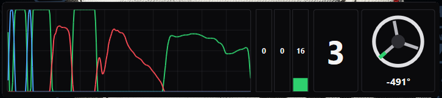
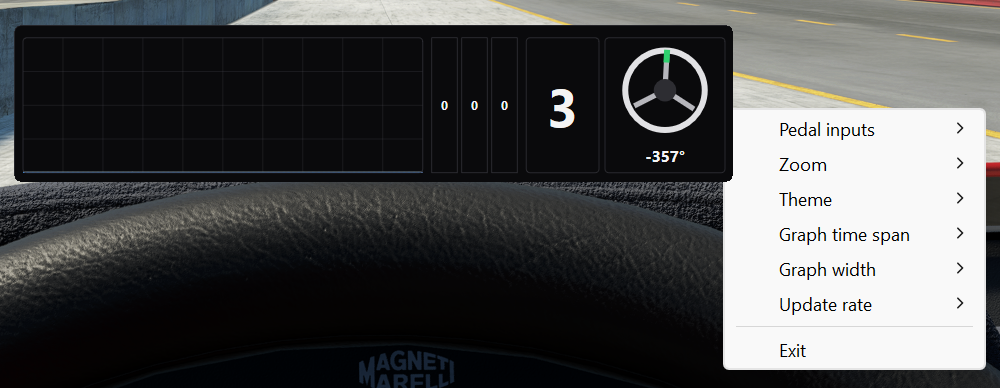

# Assetto Corsa EVO Driver Inputs Widget


A small, always-on-top native Win32 overlay for **Assetto Corsa EVO** showing driver inputs. It uses Direct2D and DirectWrite to display:

- Steering-wheel rotation and angle
- Current gear
- Vertical throttle, brake, and clutch gauges
- A scrolling pedal graph, with the throttle trace turning **purple** while TC is active and the brake trace turning **yellow** while ABS is active

Right-click the overlay to configure:

- Which pedal inputs are shown
- Graph time span from 5–30 seconds
- Graph width: Small, Medium, or Large
- Complete overlay scale from 50–250%
- Dark or light theme
- Telemetry polling and redraw at 30 or 60 Hz



> **NOTE:** The overlay regularly brings itself above other windows, including the game, and may cover its own settings menu. If that happens, right-click near the overlay's bottom-left corner to keep the menu visible.

The graph remains visible outside a driving session, with neutral gauges when the game is absent. Drag anywhere to move the window. Preferences and window position are saved automatically in `%LOCALAPPDATA%\ACEvoDriverInput\settings.json`.

## Installation

1. Open the [latest GitHub Release](https://github.com/johnliu55tw/acevo-driver-input-widget/releases/latest) and download the Windows x64 **`*-win-x64.exe`** file. It is a compressed standalone build and needs no separate .NET installation.
2. Save the executable wherever you want to keep the app and run it. There is no installer. To update, download the new version from Releases and replace the old executable.
3. Start Assetto Corsa EVO and enter a driving session. Telemetry will not work until a driving session has started.

Version history and release notes are on the [Releases page](https://github.com/johnliu55tw/acevo-driver-input-widget/releases).

## Run from source

Requirements: Windows and the .NET 10 SDK.

```powershell
dotnet run --project .\ACEvo-Driver-Input.csproj
```

## Releasing

Finish and push changes on `main`, then create and push a version tag:

```powershell
git switch main
git pull --ff-only
git tag -a v0.1.0 -m "v0.1.0"
git push origin v0.1.0
```

Replace `v0.1.0` with the next `vX.Y.Z` version. Pushing the tag runs the [release workflow](.github/workflows/release.yml), which validates the project, builds the self-contained Windows x64 executable, and publishes it in the matching GitHub Release. The tag supplies the version in the executable metadata and download name. GitHub Release notes serve as the changelog; edit the generated notes to add a short user-facing summary when needed.

If a release workflow fails, fix and push the workflow on `main`, then open **Actions → Release → Run workflow**, select `main`, and enter the existing tag to retry it. The retry builds the original tagged source with the corrected workflow; do not move or recreate the tag.

## Telemetry implementation

AC EVO 0.6 introduced its updated shared-memory output. This application opens both `Local\acevo_pmf_physics` and `Local\acevo_pmf_graphics` read-only with `MemoryMappedFile.OpenExisting`; it never creates mappings when the game is absent.

Only the fields required by this overlay are read:

| Block | Byte offset | Type | Field |
| --- | ---: | --- | --- |
| Physics | 0 | `int32` | packet id |
| Physics | 4 | `float` | `gas` (`0..1`) |
| Physics | 8 | `float` | `brake` (`0..1`) |
| Physics | 204 | `float` | `tc` intervention intensity |
| Physics | 252 | `float` | `abs` intervention intensity |
| Physics | 364 | `float` | `clutch` (`0..1`) |
| Physics | 672 | `int32` | `tcInAction` |
| Physics | 676 | `int32` | `absInAction` |
| Graphics | 0 | `int32` | packet id |
| Graphics | 4 | `int32` | `status` (`0=off`, `1=replay`, `2=live`, `3=pause`) |
| Graphics | 45 | `bool` | `tc_active` |
| Graphics | 46 | `bool` | `abs_active` |
| Graphics | 68 | `int16` | `gear_int` (`0=R`, `1=N`, `2=1st`, …) |
| Graphics | 156 | `int32` | signed `steer_degrees` |

Pedals come from physics while steering uses the graphics block's degree value. The raw physics clutch value is inverted at the reader boundary so the displayed clutch follows the overlay's pedal convention. TC and ABS activity are merged from the physics `*InAction` flag, physics intervention intensity, and graphics active flag so any source can mark an intervention.

The reader checks each block's packet id before and after its own snapshot. If either block is being updated, that combined sample is skipped. The graph adds samples during live and paused states, and the current gauges also display values during replay.

## Research sources

- [Kunos/505 Games shared-memory documentation on Steam](https://steamcommunity.com/sharedfiles/filedetails/?id=3707421508) — canonical mapping names and data layout.
- [Community field-by-field transcription and validation](https://github.com/albertowd/live-telemetry-evo/blob/develop/docs/SHARED_MEMORY.md) by [albertowd](https://github.com/albertowd) — the source for the detailed telemetry offsets, units, packing, and concurrency notes used here, cross-checked against the official guide.
